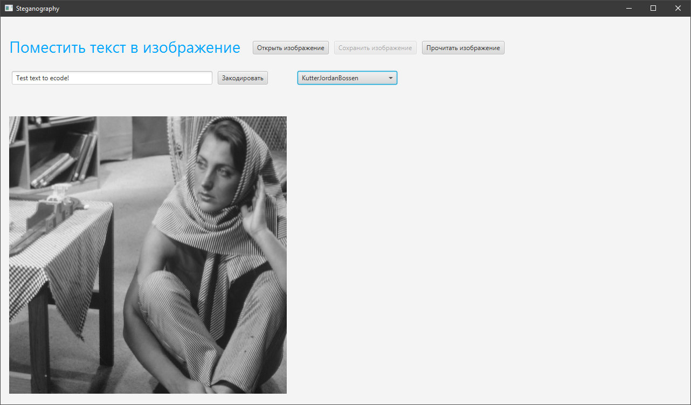
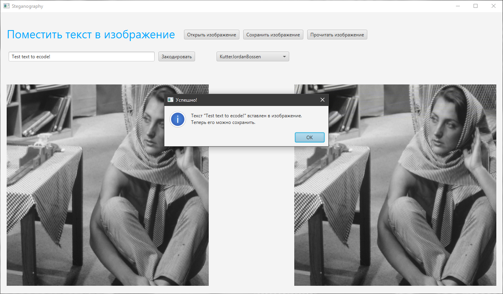
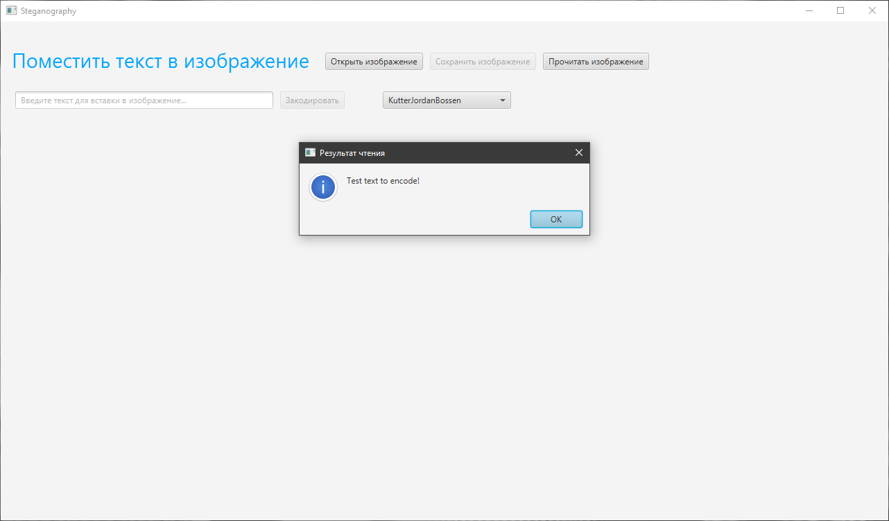

# Image Steganography

Приложение для [кодирования/декодирования текста в цифровых изображениях](https://ru.wikipedia.org/wiki/%D0%A1%D1%82%D0%B5%D0%B3%D0%B0%D0%BD%D0%BE%D0%B3%D1%80%D0%B0%D1%84%D0%B8%D1%8F_%D0%B2_%D1%86%D0%B8%D1%84%D1%80%D0%BE%D0%B2%D1%8B%D1%85_%D0%B8%D0%B7%D0%BE%D0%B1%D1%80%D0%B0%D0%B6%D0%B5%D0%BD%D0%B8%D1%8F%D1%85)

Поддерживаемые алгоритмы:
* [Least Significant Bit - Наименее значимый бит](https://ru.wikipedia.org/wiki/%D0%A1%D1%82%D0%B5%D0%B3%D0%B0%D0%BD%D0%BE%D0%B3%D1%80%D0%B0%D1%84%D0%B8%D1%8F#%D0%9C%D0%B5%D1%82%D0%BE%D0%B4_LSB)
* [Kutter Jordan Bossen - Метод Куттера-Джордана-Боссена](https://ru.wikipedia.org/wiki/%D0%9C%D0%B5%D1%82%D0%BE%D0%B4_%D0%9A%D1%83%D1%82%D1%82%D0%B5%D1%80%D0%B0-%D0%94%D0%B6%D0%BE%D1%80%D0%B4%D0%B0%D0%BD%D0%B0-%D0%91%D0%BE%D1%81%D1%81%D0%B5%D0%BD%D0%B0)

Особенности:
* Формат файлов - png (остальные не тестировались).
* Поддерживается латиница и частично кириллица.
* Реализовано сравнение изображений (закодированного и исходного) по метрикам [MSE](https://en.wikipedia.org/wiki/Mean_squared_error), [RMSE](https://en.wikipedia.org/wiki/Root-mean-square_deviation) и [PSNR](https://en.wikipedia.org/wiki/Peak_signal-to-noise_ratio) (вывод результатов в консоли)
*	Формат кодирования: "<encoded_text_length> <encoded_text>". Таким образом, если кодируется строка "Hello", в изображение будет записано "5 Hello".
*	При шифровании каждый байт сообщения шифруется в один пиксель, поэтому максимальный размер кодируемой картинки должен быть в 3 раза меньше.

Проект написан на языке Java с использованием JavaFX.

